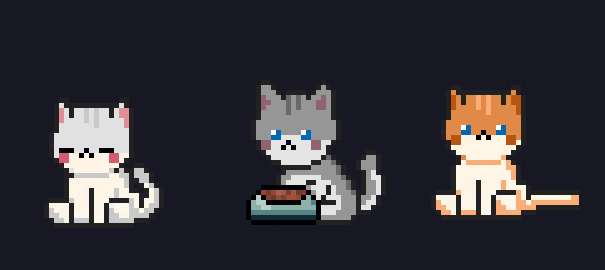

# Desktop Cat

A simple digital pet for your desktop. 



## Features

- Transparent, frameless window that floats above other applications
- Idle animation cycle: sitting → eating → falling asleep
- Draggable — click and hold to move the cat anywhere on screen
- Spawns in the bottom-right corner of your screen on startup
- Press `Esc` to close

## Requirements

- Python 3.9+
- Dependencies listed in `requirements.txt`
- A `cat.png` sprite sheet (see [Sprite Sheet Setup](#sprite-sheet-setup) below — not included in this repo)

## Sprite Sheet Setup

This app needs a sprite sheet to animate the cat, but the art isn't bundled in this repository. You'll need to grab it yourself:

1. Download the **Cat Mega Bundle** from [toffeecraft.itch.io/cat-mega-bundle](https://toffeecraft.itch.io/cat-mega-bundle). It's honour-ware (name-your-price, free is a valid price) — support the artist if you can.
2. Unzip the downloaded archive.
3. Inside, go to `CatPackPaid/CatPackDifferentSkins/`.
4. Pick any one skin you like.
5. Copy it into the root of this repo and rename it to `cat.png`.

```bash
cp "path/to/CatPackPaid/CatPackDifferentSkins/<your-chosen-skin>.png" ./cat.png
```

## Installation

1. Clone the repository:

```bash
   git clone <repo-url>
   cd desktop-cat
```
2. (Recommended) Create a virtual environment:

```bash
   python3 -m venv venv
   source venv/bin/activate
```
3. Install dependencies:

```bash
   pip install -r requirements.txt
```
4. Add your `cat.png` sprite sheet as described in [Sprite Sheet Setup](#sprite-sheet-setup).

## Running

Run the app directly:

```bash
python3 main.py
```

### Running as a non-blocking (background) process

If you want the cat to run in the background and free up your terminal, launch it detached from the shell:

```bash
nohup python3 main.py > /dev/null 2>&1 &
disown
```

- `nohup ... &` runs the process in the background and keeps it alive after you close the terminal.
- `> /dev/null 2>&1` discards output so it doesn't clutter your terminal.
- `disown` detaches the process from the current shell session entirely.

To stop it later, find and kill the process (if unable to close the program normally):

```bash
pkill -f main.py
```

### Adding a shortcut alias

To avoid retyping the full command, add an alias to `~/.bash_aliases` (create the file if it doesn't exist) or directly to `~/.bashrc`:

```bash
echo "alias nekosama='nohup python3 /path/to/desktop-cat/main.py > /dev/null 2>&1 & disown'" >> ~/.bash_aliases
source ~/.bash_aliases
```

If you're using a virtual environment, point to its Python binary instead:

```bash
echo "alias nekosama='nohup /path/to/venv/bin/python3 /path/to/desktop-cat/main.py > /dev/null 2>&1 & disown'" >> ~/.bash_aliases
source ~/.bash_aliases
```

After this, you can launch the cat from anywhere with:

```bash
nekosama
```

> Note: if `~/.bash_aliases` isn't sourced by your `~/.bashrc`, add this to `~/.bashrc` first:
> 
> ```bash
> if [ -f ~/.bash_aliases ]; then 
> . ~/.bash_aliases; 
> fi
> ```
> 
> (Ubuntu's default `.bashrc` already includes this, so most users won't need it.)

## Running on startup (Ubuntu)

To have Desktop Cat launch automatically when you log in:

Create a `.desktop` file:

```bash
   mkdir -p ~/.config/autostart
   nano ~/.config/autostart/nekosama.desktop
```

   Paste in the following, adjusting the paths to match your setup:

```ini
   [Desktop Entry]
   Type=Application
   Name=Nekosama
   Exec=/path/to/venv/bin/python3 /path/to/desktop-cat/main.py
   X-GNOME-Autostart-enabled=true
   NoDisplay=false
   Terminal=false
```
3. Save the file. The cat will now start automatically on your next login.
To disable autostart later, delete the file.

## Platform notes

- **Tested on:** Ubuntu (22.04+)
- **Wayland:** On Ubuntu sessions running Wayland, window dragging and always-on-top behavior are unreliable due to Wayland's compositor restrictions. The app automatically detects this and falls back to the X11 (XCB) backend. You can check which session you're running with:

```bash
  echo $XDG_SESSION_TYPE
```
- Not yet tested on Windows or macOS. Contributions and reports for other platforms are welcome.